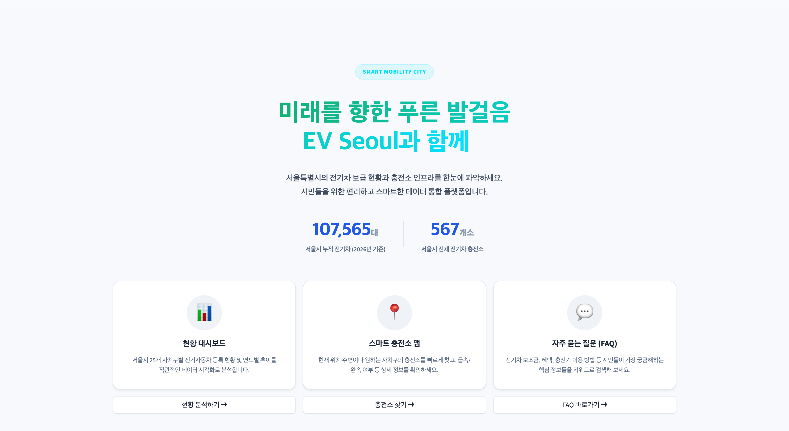
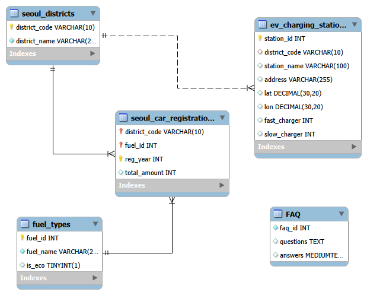

<h1> 🚗 EV Seoul: 전기차 충전 인프라 및 등록 현황 분석 서비스 🔋 </h1>

<br>

## ⚡ 서울시 전기차 인프라를 더 쉽게 이해하다
> **서울시 전기차 충전 인프라와 전기차 등록 현황을 분석하고, 사용자가 충전소 정보와 지역별 인프라 수준을 직관적으로 확인할 수 있도록 만든 데이터 기반 서비스입니다.**
>
> **핵심 목표**: 공공 데이터를 활용해 충전소 데이터를 수집·가공하고, 지도 기반 시각화와 데이터 분석 기능을 통해 사용자가 효율적인 이동 및 충전 계획을 세울 수 있도록 돕는 것을 목표로 합니다.
<br>

---


<br>

## 1. Team Route 👥
### 누가 무엇을 했는지 구조화

</p>

| 이름 | 역할 | 담당 분석 및 업무 |
| :----- | :----- | :----- |
| **박제섭** | **PM** | 기획 / FAQ 데이터 수집·전처리 / 텍스트 분석 / 위치 데이터 가공 |
| **박지유** | **Data Engineering** | 데이터 수집 및 전처리 / 충전소 등록 데이터 가공 / DB 모델링 및 아키텍처 설계 / DB 구축 및 운영 관리 / 회의록 관리 |
| **박세빈** | **Data Engineering** | 데이터 수집 및 전처리 / 자동차 등록 데이터 가공 / DB 모델링 및 아키텍처 설계 / DB 구축 및 운영 관리 |
| **채동현** | **Frontend / Visualization** | Streamlit 기반 데이터 대시보드 개발 / UI, UX 설계 및 구현 |
| **윤태선** | **Frontend** | 웹 서비스 UI 구현 / 데이터 시각화 |

<br>

---

<br>

## 2. Visualization Preview 🖼️




<br>

---

<br>

## 3. Key Signals 💡
### 분석 결과의 주요 포인트

* **현황 대시보드 제공**: 서울특별시 행정구별 지도에 전기차 현황 분포를 표시하고, 지역별·연도별 전기차 등록 대수 비교 및 전체 차량 대비 전기차 등록 비율, 증가 추이를 분석합니다.
* **충전소 맵 제공**: 행정구별 전기차 충전소 현황과 위치 정보를 제공하며, 행정구역별 충전소 분포와 충전기 종류(완속, 급속)에 따른 충전기 수를 함께 시각화합니다.
* **FAQ 기능 제공**: 크롤링 기반 FAQ 데이터와 형태소 분석 기반 키워드 추출 기능을 제공하고, 상위 인기 검색어와 사용자 직접 검색 기능을 지원합니다.

<br>

---

<br>

## 4. 활용 가능성 🎯
### 분석 데이터를 통한 실질적 기대 효과

* **충전 인프라 접근성 향상**: 사용자가 충전소 위치 및 현황을 쉽게 파악할 수 있습니다.
* **지역별 인프라 비교 지원**: 지역별 충전 인프라 수준을 비교하여 효율적인 이동 및 충전 계획 수립이 가능합니다.
* **직관적인 정보 전달**: 지도 기반 시각화와 대시보드를 통해 전기차 관련 정보를 빠르게 이해할 수 있습니다.
* **맞춤형 분석 지원**: 사용자가 선택한 자치구와 연도 조건에 따라 차트와 지도가 연동되어 개인화된 탐색이 가능합니다.

<br>

---

<br>

## 5. Project Structure 🚀
### 프로젝트 디렉토리 구조


```text
SKN30_project1_team2/
├── .gitignore
├── .python-version
├── pyproject.toml
├── requirements.txt
├── README.md
├── Streamlit_main.py
├── uv.lock
├── assets/
│   ├── ERD.png
│   └── preview.png
├── crawling/
│   ├── crawling_nuri.py
│   ├── crawling_seoul.py
│   ├── crawling_sino.py
│   ├── README.md
│   ├── pyproject.toml
│   ├── uv.lock
│   └── csv/
│       ├── nuri.csv
│       ├── seoul.csv
│       └── sino.csv
└── data/
	├── data_set_ev_charging_stations_new.csv
	├── data_set_faq.csv
	├── data_set_fuel_types.csv
	├── data_set_seoul_districts.csv
	├── seoul_ev_data.py
	├── year_amount.csv
	└── __init__.py

```

<br>

---

<br>

## 6. ERD 구조도 📐
### 데이터 구조 시각화 (테이블 관계)

<p align="center">
  
</p>


<br>

---

<br>

## 7. Data Route 🔄
### 데이터 흐름 설명 (출처 → 전처리 → 서비스)

##### **Raw 데이터 수집 (Source)**  
* **서울시 자치구별 연료별 자동차 등록 현황**
* **전기차 충전소 설치현황**
* **EV 충전소 관련 FAQ**
* **그린카 보급 관련 FAQ**
* **무공해차 통합누리집 FAQ**

##### **전처리 (Preprocessing)**  
* 대시보드 구현과 분석에 필요한 핵심 컬럼만 선별하여 CSV 컬럼을 최적화했습니다.
* 공공기관 파일 데이터와 FAQ 데이터를 데이터베이스 테이블 구조에 맞게 정리했습니다.
* 충전소, 자동차 등록, FAQ 데이터를 서비스 목적에 맞게 가공했습니다.

##### **서비스 구현 (Dashboard & Web Service)**  
* Streamlit 기반 웹 서비스를 구축했습니다.
* 현황 대시보드, 충전소 맵, FAQ 페이지를 기능별로 분리하여 정보 접근성을 높였습니다.
* 자치구·연도 선택 조건에 따라 전체 차트와 지도가 즉시 연동되도록 구현했습니다.
* FAQ 페이지에는 5개 단위 페이지네이션과 검색 기능을 추가했습니다.

<br>

---

<br>

## 8. Tech Stack 🛠️
### 사용한 기술 스택

<div align="center">

#### 💻 Language & DATA
Python 3.13, CSS
pandas, selenium

<br>

#### 🗄 Database
MySQL 8.0

<br>

#### 📊 Visualization & App
Streamlit, Plotly, Folium

<br>

#### ⚙️ Tools
Git, DBeaver, MySQL Workbench 8.0, VSCode

</div>

<br>

---

<br>

## 9. 실행 가이드
#### 프로젝트 루트에서 주요 파일 확인
```bash
# 프로젝트 주요 설정 파일
pyproject.toml
requirements.txt
uv.lock
```

#### 메인 앱 실행
```bash
python -m streamlit run Streamlit_main.py
```

<br>

---

<br>

## 10. Reference 📚

* [서울시 자치구별 연료별 자동차 등록 현황](https://data.seoul.go.kr/dataList/OA-15640/S/1/datasetView.do)
* [전기차 충전소 설치현황](https://www.data.go.kr/data/15039290/fileData.do#)
* [EV 충전소에 대한 상위 10개 FAQ](https://sinoevse.com/ko/top-10-faqs-about-ev-charging-stations/)
* [그린카 보급(자주 묻는 질문)](https://news.seoul.go.kr/env/archives/517115#sns_elem_dropdownmenu)
* [무공해차 통합누리집 FAQ](https://ev.or.kr/nportal/partcptn/initFaqAction.do#)
